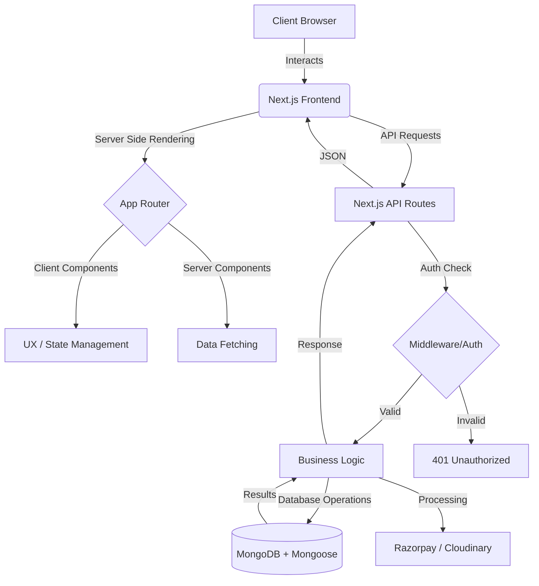

# 💎 Kanvei.in - Premium E-Commerce Platform

> **Elegant. Premium. Seamless.** 
> Kanvei is a high-performance, full-stack E-commerce solution built with **Next.js 15**, designed to deliver a luxury shopping experience with robust administrative control.

---

## 🎨 Features At A Glance

🚀 **High Performance**
- Server-side rendering (SSR) & Static Site Generation (SSG) for lightning-fast loads.
- Image optimization using **Sharp** and **Cloudinary**.

🔐 **Advanced Auth System**
- Hybrid Authentication with **NextAuth.js** and Custom **JWT**.
- Secure OTP-based registration and password recovery.
- Account status management (Unblocked/Blocked).

🛒 **E-Commerce Excellence**
- Dynamic Product discovery with **Attributes** (Size, Color, etc.) and variants.
- Real-time **Cart** and persistent **Wishlist** management.
- Multi-tier **Coupon & Discount** engine.
- Responsive **Category** browsing.

💳 **Secure Checkout**
- Seamless **Razorpay** payment gateway integration.
- Intelligent Order tracking and confirmation.
- Transparent Shipping and Return policy management.

🛠️ **Admin Power**
- Comprehensive dashboard for monitoring Users, Orders, and Products.
- Rich-text content creation using **Jodit Editor**.

---

## 🏗️ Architecture & Codeflow

Kanvei follows a modern **Clean Architecture** combined with the efficiency of **Next.js App Router**.

### 🔄 System Flow Diagram



---

## 🛠️ Tech Stack

Kanvei is built on a stack optimized for scalability, developer productivity, and user experience.

| Category | Technology |
| :--- | :--- |
| **Core Framework** | Next.js 15.5+ (React 19) |
| **Styling** | Tailwind CSS 4, MUI (Material UI), Framer Motion |
| **Database** | MongoDB with Mongoose ODM |
| **Authentication** | NextAuth.js, JWT, BcryptJS |
| **Payments** | Razorpay SDK |
| **Media** | Cloudinary (Storage & Transformations) |
| **Emailing** | Nodemailer |
| **State/Icons** | React Context API, Lucide Icons, React Icons |

---

## 📁 Project Structure

```bash
📦 kanvei.in
 ├── 📂 public/            # Static assets (logos, images, fonts)
 ├── 📂 src/
 │   ├── 📂 app/           # App Router (Pages & API Routes)
 │   │   ├── 📂 api/       # Internal Backend Endpoints
 │   │   ├── 📂 (shop)/    # Grouped Shop Routes (Categories, Products)
 │   │   ├── 📂 blog/      # Articles and Content
 │   │   └── 📂 admin/     # Protective Dashboard Routes
 │   ├── 📂 components/    # Reusable UI Atoms, Molecules & Organisms
 │   ├── 📂 contexts/      # Global State Providers (Cart, Wishlist, Auth)
 │   ├── 📂 hooks/         # Custom React Hooks
 │   ├── 📂 lib/           # Core Utilities (DB connect, Auth helpers)
 │   └── 📂 models/        # Mongoose Database Schemas
 ├── 📜 next.config.mjs    # Performance & Image Configurations
 └── 📜 tailwind.config.js # Custom Styling Tokens
```

---

## 🚀 Getting Started

### 1. Prerequisite
- Node.js (v18 or higher)
- MongoDB Instance
- Cloudinary & Razorpay API Keys

### 2. Installation
```bash
git clone https://github.com/your-repo/kanvei.git
cd kanvei
npm install
```

### 3. Environment Setup
Create a `.env` file in the root and configure:
```env
MONGODB_URI=your_mongodb_uri
JWT_SECRET=your_jwt_secret
NEXTAUTH_SECRET=your_nextauth_secret
RAZORPAY_KEY_ID=your_key
RAZORPAY_KEY_SECRET=your_secret
CLOUDINARY_CLOUD_NAME=your_name
CLOUDINARY_API_KEY=your_key
CLOUDINARY_API_SECRET=your_secret
```

### 4. Run Development
```bash
npm run dev
```
Open [http://localhost:3000](http://localhost:3000) to view your premium store.

---

## ✨ Design Philosophy

At Kanvei, we believe e-commerce should be **intuitive** and **visually striking**. The UI uses **Montserrat** for a sophisticated feel and **Inter** for clarity, ensuring that every interaction feels premium.

---
⭐ *Developed by the Kanvei Team*
